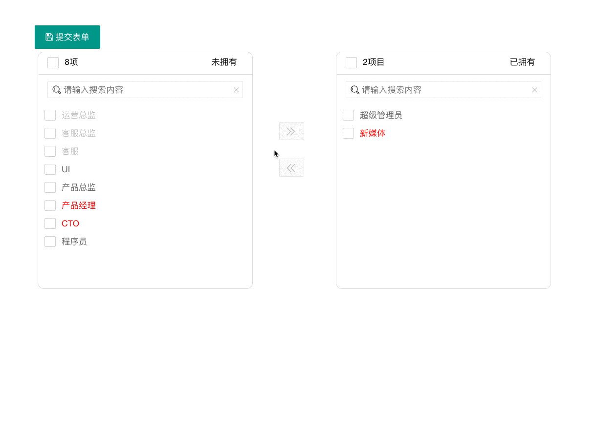
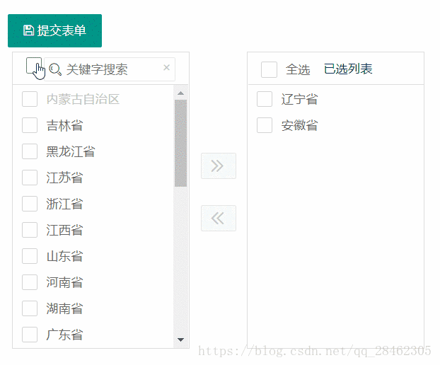
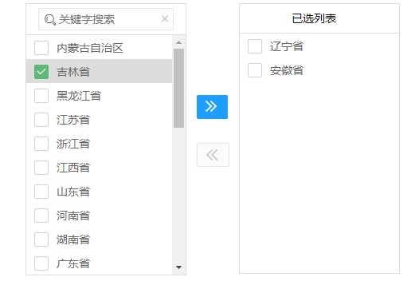

# layui-transfer

## v1.2

因项目需要，用户权限管理需要使用穿梭框来绑定角色，在两个版本的基础上优化了一版。

### 效果展示

### 框架要求

layui >=2.2.6

### 修订记录

#### 2018-10-30

1. 优化了穿梭框，新增角色禁用状态红色样式；
2. 增加了左右的选择数量统计；
3. 左右两区域分别增加搜索功能；

## 1.1

[【原文】1.1版](https://blog.csdn.net/qq_28462305/article/details/81842187)

基于前辈的组件修改，layui风格，已修改成layui第三封控件规范
1. 在原基础上添加多选；
2. 添加拼音搜索；

[【原文】整合 layui 穿梭框组件](https://fly.layui.com/jie/30248/)

[【引用】拼音搜索用到的JS，用法简单!](https://github.com/xmflswood/pinyin-match)

[版本库地址](https://gitee.com/FLB0821/layui_widget/tree/master)

## v1.0

[原版穿梭框组件](https://fly.layui.com/jie/30248/)

1.效果如下

2.预览地址 http://ui.cymall.xin/demo/transfer/index.html 

3.下载链接： https://pan.baidu.com/s/1Vo_GAozyP2vps3bXBWkJew 密码：rl9p

## 补充
etc文件夹之前版本的代码

